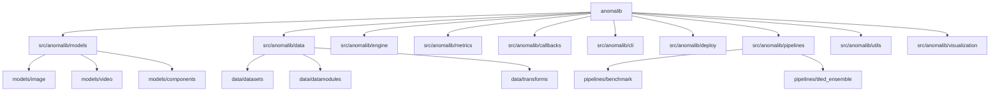

# AGENTS.md

This file serves as a hierarchical knowledge base for AI coding agents to understand the `anomalib` project structure and conventions.

<!-- BEGIN MANAGED SECTION -->

## Project Architecture

### Module Descriptions
- `src/anomalib/models`: Core anomaly detection models. Split by modality (image/video) and shared components.
- `src/anomalib/data`: Data ingestion, standardized datasets, and preprocessing transforms.
- `src/anomalib/engine`: Orchestration of training and inference loops.
- `src/anomalib/metrics`: Domain-specific metrics (e.g., AUROC, PRO) and evaluation logic.
- `src/anomalib/callbacks`: Extensible hooks for logging, visualization, and lifecycle management.
- `src/anomalib/cli`: Command line interface for running experiments and installs.
- `src/anomalib/deploy`: Tools for model export (OpenVINO, Torch) and deployment inferencers.
- `src/anomalib/pipelines`: High-level workflows for benchmarking and ensemble strategies.
- `src/anomalib/utils`: Cross-cutting utilities for CV, logging, and type definitions.
- `src/anomalib/visualization`: Logic for generating anomaly maps and result images.

## Public API Surface

Key types exported from `anomalib` root:
- `LearningType`: Enum (`ONE_CLASS`, `ZERO_SHOT`, `FEW_SHOT`).
- `TaskType`: Enum (`CLASSIFICATION`, `SEGMENTATION`).
- `PrecisionType`: Enum (`FLOAT32`, `FLOAT16`).

## Models Registry

### Image Models
Located in `src/anomalib/models/image/`:
- `anomaly_dino`, `cfa`, `cflow`, `csflow`, `dfkde`, `dfm`, `dinomaly`, `draem`, `dsr`, `efficient_ad`, `fastflow`, `fre`, `ganomaly`, `general_ad`, `l2bt`, `padim`, `patchcore`, `patchflow`, `reverse_distillation`, `stfpm`, `supersimplenet`, `uflow`, `uninet`, `vlm_ad`, `winclip`.

### Video Models
Located in `src/anomalib/models/video/`:
- `ai_vad`, `fuvas`.

## Conventions

- **Model Structure**: Standard image/video models should follow the pattern:
  - `lightning_model.py`: PyTorch Lightning wrapper.
  - `torch_model.py`: Core PyTorch implementation.
  - `README.md`: Model-specific documentation.
- **Data Layout**: Datasets are mirrored in `data/datasets` (raw loading) and `data/datamodules` (PyTorch Lightning wrappers).
- **Componentization**: Reusable layers/blocks should be placed in `src/anomalib/models/components`.

## CI & Automation

### Workflows
- `opencode-agents-md-sync.yml`: Weekly maintenance of `AGENTS.md`.
- `opencode-docs-sync.yml`: Synchronization of codebase with documentation.
- `opencode-issue-triage.yml`: Automated issue classification and triage.

### Agent Configuration Files
| Agent | Config Path | Purpose |
| :--- | :--- | :--- |
| Issue Triage | `.github/agents/issue-triage-opencode.md` | Classifies and prioritizes GitHub issues |
| AGENTS.md Sync | `.github/agents/agents-md-sync-opencode.md` | Maintains this knowledge base |
| Docs Sync | `.github/agents/docs-sync-opencode.md` | Detects and fixes doc drift |
| Agentic Workflows| `.github/agents/agentic-workflows.agent.md` | General workflow orchestration |

<!-- END MANAGED SECTION -->
